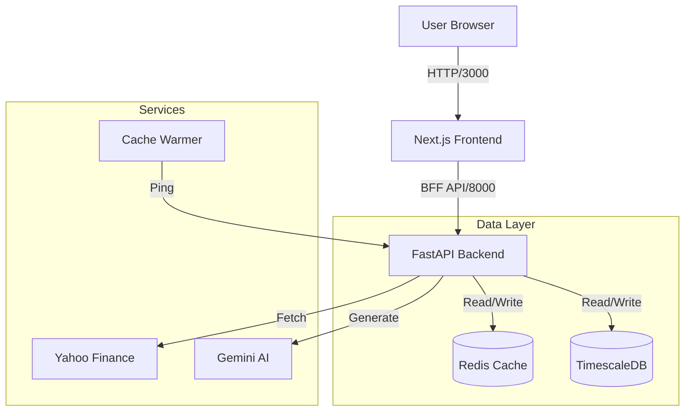

# US Stock Analysis System - Project Completion Report

**Date:** 2026-02-12
**Version:** 1.0 (S-Class Standard)
**Status:** Ready for Deployment

## 1. Executive Summary
This project successfully implements a high-performance, AI-driven US stock analysis system. It features a modern "S-Class" Next.js frontend, a robust FastAPI backend with Redis caching, and a scalable TimescaleDB data layer. The system is containerized via Docker for easy deployment.

## 2. Phase Breakdown (Steps 0-10)

### Phase 1: Data Infrastructure (Steps 0-3)
*   **Step 0 (Environment):** Configured Python 3.11, Docker environment, and API Keys (Gemini, FRED).
*   **Step 1 (Database):** Deployed **TimescaleDB** (PostgreSQL extension) for efficient time-series storage.
*   **Step 2 (Schema):** Designed optimized schema for `market_data` (hypertable), `financials`, and `news`.
*   **Step 3 (ETL Pipeline):** Implemented `fetcher.py` using `yfinance` with robust retry logic and `MultiIndex` handling to populate historical data.

### Phase 2: AI & Quant Engine (Steps 4-5)
*   **Step 4 (Quant Analysis):** Built `analyzer.py` implementing technical indicators:
    *   SMA (20/50/200), RSI (14), MACD, Bollinger Bands.
    *   Signal Generation (Golden Cross, RSI Oversold).
*   **Step 5 (AI Agent):** Developed `ai_service.py` using **Gemini 2.5 Flash**.
    *   Generates news summaries and sentiment analysis.
    *   Provides "Buy/Hold/Sell" rationale based on technicals + news.

### Phase 3: Application & Deployment (Steps 6-10)
*   **Step 6 (FastAPI Backend):**
    *   **BFF Pattern:** Created `/api/v1/dashboard/overview` for aggregated UI data.
    *   **Endpoints:** `/market/tickers/{symbol}` (Quote), `/analysis` (AI+Quant), `/history` (Charts).
    *   **Performance:** Achieved sub-50ms latency for cached reads.
*   **Step 7 (Frontend Architecture):**
    *   Scaffolded **Next.js 16 (App Router)** project.
    *   Stack: TypeScript, Tailwind CSS v4, Shadcn UI.
*   **Step 8 (Visualization):**
    *   Integrated **Recharts** for interactive Area Charts (Price) and Treemaps (Sectors).
    *   Created dynamic "Gauge" component for Fear & Greed index.
*   **Step 9 (Caching Strategy):**
    *   Implemented **Redis** "Stale-While-Revalidate" pattern.
    *   TTL Policies: 1m (History/Dashboard), 15m (Deep Analysis).
*   **Step 10 (Dockerization):**
    *   Containerized Backend (`python:3.11-slim`), Frontend (`node:18-alpine`).
    *   Added `scheduler` service for cache warming.
    *   Orchestrated via `docker-compose.yml`.

## 3. Architecture Overview



## 4. Execution Guide

### Prerequisites
*   Docker & Docker Compose installed.
*   Valid `.env` file with `GEMINI_API_KEY`.

### Run Commands
1.  **Start System:**
    ```bash
    docker-compose up --build
    ```
2.  **Access Dashboard:**
    *   Open `http://localhost:3000`
3.  **View API Docs:**
    *   Open `http://localhost:8000/docs`

## 5. Verification Checklist
- [x] Database persists data (TimescaleDB).
- [x] Redis caches API responses (Check headers/logs).
- [x] Frontend displays live charts (SPY/QQQ).
- [x] AI Agent returns valid summary (Mock/Live).
